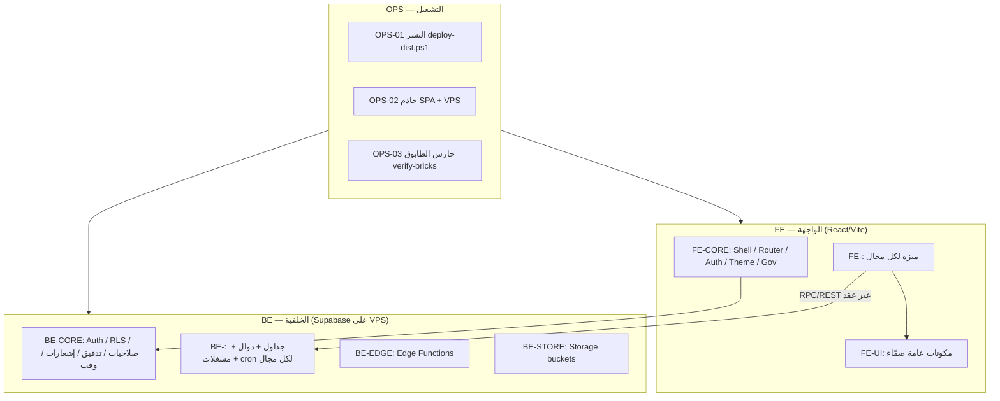

# معمارية InfTeleKarbala — المخطط الرئيسي المرقّم

> المرجع الأعلى للهيكل. كل طابوقة لها رقم ثابت لا يتغيّر ولا يُعاد استخدامه.
> صيغة الرقم: `<الطبقة>-<المجال>-<رقم>`، مثل `BE-ATT-04` أو `FE-ATT-02`.

## 0. الصورة الكبرى



**قاعدة العزل الذهبية:** المجال لا يقرأ جداول مجال آخر مباشرة؛ يمرّ عبر دالة/واجهة عامة مسجّلة في عقد الطرف الآخر.

## 1. المجالات (Domains) — مُستخرجة من الجرد الفعلي

| الرمز | المجال | جداول DB الرئيسية | الواجهة الحالية |
|---|---|---|---|
| CORE | الهوية، الصلاحيات، المحافظات، الإشعارات، التدقيق، الوقت | profiles, departments, field_permissions, system_notifications, activity_logs, field_change_logs, login_logs, rate_limits, api_rate_limits, _encryption_keys, system_error_logs | context/*, lib/supabase, utils/permissions, AppNotifications |
| HR | ملف الموظف والبيانات الإدارية | profiles, available_profiles, yearly_records, committees/thanks/penalties_details, administrative_summary, user_acknowledgments | components/admin (ProfileDataUpdater, TabManageEmployees, DepartmentsManager…) |
| FIN | المالية والرواتب واللقطات الشهرية | financial_records, monthly_snapshots(+profiles/financials) | FinancialDataUpdater, utils/salaryRules, payrollValidation |
| INC | الحوافز | incentive_records, incentive_point_values | IncentivesTabContent |
| ATT | الحضور والبصمة والجداول والكشك | attendance_records, attendance_settings, attendance_exceptions, attendance_devices, work_schedules(+days), work_locations(+employees), official_holidays, public_holidays, webauthn_credentials, fingerprint_templates, device_change_requests, kiosk_* | features/attendance, features/kiosk |
| LEV | الإجازات والزمنيات والطلبات | leave_requests, leave_history, leaves_details, five_year_leaves, leave_trigger_logs | features/requests |
| PRO | الترفيع | promotion_results, promotion_settings | features/promotion |
| TRN | التدريب الصيفي | summer_training_* | features/training |
| COM | الدردشة والاتصال والاجتماعات | conversations, messages, calls, call_candidates, hr_audio_calls, meetings, meeting_participants | components/chat, call, context/Chat*, Call* |
| MED | الإعلام والمعرفة والاستطلاعات | media_content, admin_tips, knowledge_progress, polls(+options/questions/responses/comments) | PollCreator, PollStats, KnowledgeContext |
| FIB | محاكي الألياف وخرائط GIS | fiber_sim_projects, fiber_sim_scores, sim_map_library | features/fiber-simulator |
| SPL | السبلاش والإطلاق | — | pages/SplashScreen, LauncherPage |

## 2. ترقيم الطابوق (السجل الكامل في `BRICKS.md`)

### BE — الخلفية
| الرقم | الطابوقة |
|---|---|
| BE-CORE-01 | الوقت (get_server_time، توقيت بغداد) |
| BE-CORE-02 | الهوية والمصادقة (authenticate_user, verify_password, change_password, 2FA edge) |
| BE-CORE-03 | الصلاحيات و RLS (is_admin, is_hr_admin, get_my_admin_role, field_permissions) |
| BE-CORE-04 | الإشعارات (system_notifications + send-notification edge + ntfy) |
| BE-CORE-05 | التدقيق والسجلات (audit triggers, activity/field_change logs) |
| BE-CORE-06 | المحافظات والأقسام (departments, governorate isolation) |
| BE-HR-01..n | ملف الموظف، السجلات السنوية، اللجان/الشكر/العقوبات |
| BE-FIN-01..n | السجلات المالية، اللقطات الشهرية، حساب الإجماليات |
| BE-INC-01 | الحوافز |
| BE-ATT-01 | الجداول (work_schedules/days) |
| BE-ATT-02 | تسجيل البصمة (submit_attendance_record_secure → RPC موحّد متوازي) |
| BE-ATT-03 | محرك الدوام الثابت |
| BE-ATT-04 | محرك المناوب |
| BE-ATT-05 | البصمات الافتراضية والإغلاق اليومي (closeout, cron) |
| BE-ATT-06 | الأجهزة والبصمة الحيوية والكشك |
| BE-ATT-07 | المواقع الجغرافية والعطل |
| BE-LEV-01..n | تقديم الطلب، آلة الحالات، الإجبارية، الأرصدة، القطع |
| BE-PRO / TRN / COM / MED / FIB | حسب المجال |
| BE-EDGE-01..11 | كل Edge Function طابوقة |
| BE-STORE-01..9 | كل bucket طابوقة (سياسات + استخدام) |

### FE — الواجهة
| الرقم | الطابوقة |
|---|---|
| FE-CORE-01 | Shell + Router + Lazy loading (App.tsx) |
| FE-CORE-02 | Auth context + ProtectedRoute |
| FE-CORE-03 | Theme / Governorate / Settings |
| FE-CORE-04 | عميل Supabase + معالجة الأخطاء |
| FE-UI-01..n | مكونات عامة صمّاء (components/ui) |
| FE-<DOMAIN>-01..n | لكل مجال: صفحات، مكونات، hooks، services — داخل `src/features/<domain>/` |

### OPS
| OPS-01 | النشر `scripts/deploy-dist.ps1` + `dist-cmp-remote.sh` |
| OPS-02 | VPS: spa_server.py، Supabase docker، ntfy |
| OPS-03 | حارس الطابوق `scripts/verify-bricks` |
| OPS-04 | فحص الأنواع والبناء |

## 3. قالب الطابوقة الموحّد

```
bricks/<ID>-<slug>/
  BRICK.md        # العقد: المسؤولية، الواجهة العامة، يعتمد على، القواعد R#، الحالات T#، الملفات المملوكة
  tests/          # اختبارات العقد (SQL للخلفية / Vitest للواجهة)
```
والكود يبقى في مكانه الطبيعي (`src/features/...` أو `supabase/migrations/...`) لكن **قائمة "الملفات المملوكة"** في BRICK.md تربطه بالطابوقة، والحارس يتحقق من وجودها وبصماتها.

## 4. الحارس `OPS-03` (ما يفحصه)
1. كل طابوقة في `BRICKS.md` لها مجلد و`BRICK.md`.
2. كل ملف مملوك موجود (ملف مفقود ⇒ «فُقدت طابوقة X / الملف Y»).
3. كل قاعدة R# لها اختبار T# واحد على الأقل، والاختبارات ناجحة.
4. لا استيراد عبر الحدود إلا من `index.ts` العام للمجال.
5. دوال DB المملوكة موجودة فعلاً على الخادم (مقارنة بالأسماء).

## 5. مشاكل مرصودة في الجرد (تُعالج ضمن طابوقها)
| # | المشكلة | الطابوقة |
|---|---|---|
| P1 | صفر اختبارات آلية | OPS-03 |
| P2 | ~200 سكربت مؤقت في `scripts/` (check_*, debug_*, fix_*) تخلط الأدوات المعتمدة بالمخلفات | OPS-01 (أرشفة إلى `scripts/_archive/` بعد موافقتك، دون حذف) |
| P3 | ملفات-وحوش 80–117KB | FE-ATT، FE-FIN، FE-INC، FE-PRO، FE-TRN |
| P4 | 110 ملف في `components/` خارج المجالات | نقل تدريجي إلى `features/<domain>` |
| P5 | دوال `submit_leave_request` ×3 و`modify_leave_request` ×2 و`process_leave_approval` ×2 (overloads) | BE-LEV |
| P6 | امتداد `pageinspect` مكشوف في public (bt_page_items, heap_page_items…) | BE-CORE-03 (أمني) |
| P7 | منطق الحضور مكرر بين العميل وDB | BE-ATT-03/04 |
| P8 | ~120 خطأ أنواع تاريخي | OPS-04 |
| P9 | مجلدات جذر متعددة للـSQL (`database/`, `sql-files/`, `supabase/migrations`, `scripts/sql`) | توحيد في `supabase/migrations` + `bricks/*/sql` |

## 6. ترتيب البناء (المراحل)
| المرحلة | المحتوى | معيار الإنجاز |
|---|---|---|
| **M0 الأساس** | هذا المخطط، `BRICKS.md`، Skill المشروع، قالب الطابوقة، الحارس OPS-03 (هيكل فقط) | الحارس يعمل ويطبع جدول الطابوق |
| **M1 الجرد** | عقد مختصر لكل طابوقة موجودة (ما هو قائم فعلاً) + ملفاته المملوكة | كل ملف في src وكل دالة DB منسوبة لطابوقة |
| **M2 النواة** | BE-CORE + FE-CORE باختبارات | اختبارات خضراء |
| **M3 الحضور والإجازات** | BE-ATT-01..07، BE-LEV، FE-ATT | حالات مسلم وغيرها خضراء |
| **M4…** | FIN، INC، HR، PRO، TRN، COM، MED، FIB | مجال بمجال |
